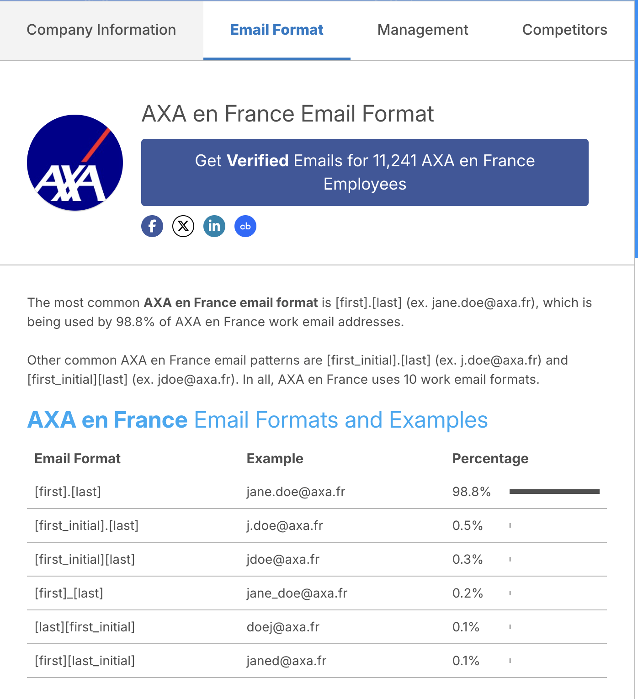
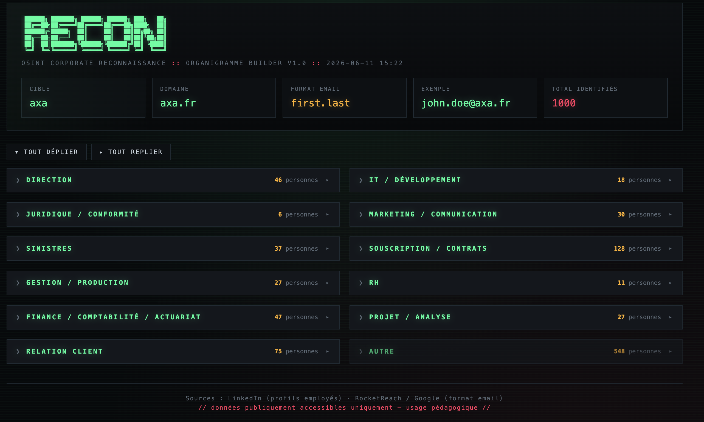
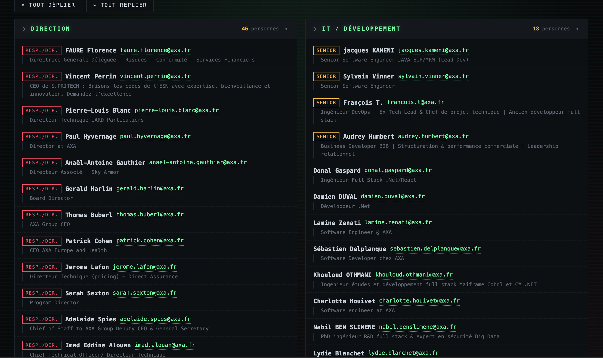

# linkedin-recon

Outil de reconnaissance OSINT corporate : reconstitue automatiquement l'organigramme d'une entreprise (noms, postes, emails) à partir de sources publiques.

Conçu pour les **pentesters**, **red teamers** et **équipes sécurité** souhaitant démontrer l'exposition d'une organisation via des données publiquement accessibles.

---

## ⚠️ Compte LinkedIn dédié fortement recommandé

LinkedIn détecte et bloque les comportements de scraping. **Utilisez un compte LinkedIn dédié**, jamais votre compte personnel.

Un ban entraîne la restriction ou la suppression définitive du compte. Avec un compte jetable, vous protégez votre identité et absorbez les éventuels bans sans conséquence.

---

## Fonctionnement

Le script enchaîne trois étapes :

```
LinkedIn (employés)  +  RocketReach/Google (format email)
         │                           │
         ▼                           ▼
  linkedin2username.py          organigramme.py
  (scraping profils)          (classification + emails)
         │                           │
         └──────────┬────────────────┘
                    ▼
           organigramme.html  (vue dark/interactive)
           organigramme.txt   (sortie terminal)
```

### Étape 1 — Scraping LinkedIn

`linkedin2username.py` (voir [Dépendances](#dépendances)) ouvre un navigateur, vous demande de vous connecter à LinkedIn, puis extrait les profils publics des employés de l'entreprise ciblée : noms, prénoms, intitulés de poste.

### Étape 2 — Détection du format email

Le format des adresses email de l'entreprise (ex: `prenom.nom@`, `jdoe@`, ...) est déterminé via **RocketReach**, un service d'intelligence commerciale qui référence les formats email de millions d'entreprises. Ces informations sont accessibles publiquement via les snippets Google :

```
site:rocketreach.co "@example.com" email format
```

**Exemple — AXA en France :**



| Format | Exemple | Usage |
|---|---|---|
| `[first].[last]` | jane.doe@axa.fr | 98.8% |
| `[first_initial].[last]` | j.doe@axa.fr | 0.5% |
| `[first_initial][last]` | jdoe@axa.fr | 0.3% |

### Étape 3 — Génération de l'organigramme

`organigramme.py` croise les données LinkedIn et le format email pour :
- Classifier les employés par service (Direction, IT, RH, Finance, etc.)
- Détecter le niveau hiérarchique (Directeur, Senior, Junior)
- Générer l'adresse email probable de chaque employé
- Produire une vue HTML interactive et une sortie terminal

---

## Prérequis

- Python 3.x
- Google Chrome ou Firefox
- `chromedriver` ou `geckodriver` :
  ```bash
  brew install geckodriver   # macOS
  # ou
  brew install chromedriver
  ```
- Un compte LinkedIn dédié au scraping (voir avertissement ci-dessus)

---

## Installation

```bash
git clone https://github.com/votre-user/linkedin-recon.git
cd linkedin-recon
python3 -m venv venv && source venv/bin/activate
pip install -r requirements.txt
```

---

## Utilisation

### Méthode rapide (tout-en-un)

```bash
chmod +x recon.sh
./recon.sh -c <slug-linkedin> -d <domaine-email>
```

Le slug LinkedIn se trouve dans l'URL de la page entreprise :
`https://www.linkedin.com/company/altima-assurances/` → slug = `altima-assurances`

**Exemple :**

```bash
./recon.sh -c altima-assurances -d altima-assurances.fr
```

Un navigateur s'ouvre pour l'authentification LinkedIn (étape manuelle), puis le script tourne de manière autonome.

### Options

```
./recon.sh -c <slug>  -d <domaine>  [-f <format>]  [-o <fichier>]

  -c    Slug LinkedIn de l'entreprise (obligatoire)
  -d    Domaine email (obligatoire)
  -f    Forcer un format email (optionnel)
  -o    Fichier de sortie (optionnel)
```

### Formats email disponibles

| Format | Exemple |
|---|---|
| `flast` | `jdoe@...` |
| `first.last` | `john.doe@...` |
| `f.last` | `j.doe@...` |
| `firstlast` | `johndoe@...` |
| `first_last` | `john_doe@...` |
| `lastf` | `doej@...` |
| `last.first` | `doe.john@...` |
| `firstl` | `johnd@...` |
| `first` | `john@...` |

### Méthode manuelle (étape par étape)

```bash
# 1. Scraping LinkedIn
python3 linkedin2username.py -c altima-assurances -o li2u-output/

# 2. Organigramme + emails
python3 organigramme.py li2u-output/altima-assurances-metadata.txt -d altima-assurances.fr

# 3. Avec format forcé
python3 organigramme.py li2u-output/altima-assurances-metadata.txt -d altima-assurances.fr -f flast
```

---

## Exemple de sortie

Vue d'ensemble de l'organigramme HTML généré (ici sur AXA — 1000 employés identifiés) :



Vue détaillée avec noms, postes et adresses email reconstituées :



> **Limite** : LinkedIn plafonne les résultats de recherche à **1000 profils par entreprise** (limite non-commerciale). Pour les grandes organisations, linkedin2username propose `--geoblast` (recherche par région géographique) et `--keywords` (par mots-clés) pour contourner cette limite.

La vue HTML est générée automatiquement dans `li2u-output/` à côté des fichiers texte.

---

## Structure du repo

```
linkedin-recon/
├── recon.sh                  # Script principal tout-en-un
├── linkedin2username.py      # Scraping LinkedIn (voir Dépendances)
├── organigramme.py           # Classification + génération emails + HTML
├── requirements.txt          # requests, selenium
└── li2u-output/              # Résultats (gitignorés)
    ├── *-metadata.txt        # Noms + postes (CSV)
    ├── *-rawnames.txt        # Noms bruts
    └── *-organigramme.html   # Vue interactive
```

---

## Dépendances

### linkedin2username

Ce projet inclut `linkedin2username.py`, issu du projet open source **[linkedin2username](https://github.com/initstring/linkedin2username)** par **initstring** (v0.29).

linkedin2username est un outil de scraping LinkedIn qui extrait les employés d'une entreprise via les profils publics. Il requiert un compte LinkedIn valide et ouvre un navigateur Selenium pour l'authentification.

> Repo original : https://github.com/initstring/linkedin2username  
> Licence : MIT

---

## Disclaimer

Cet outil exploite uniquement des données **publiquement accessibles**. Son utilisation doit se faire :
- Dans le cadre de tests de sécurité **autorisés** (pentest, red team, sensibilisation)
- Dans le respect de la législation en vigueur (RGPD, CFAA, etc.)
- Avec l'accord de l'organisation ciblée

L'auteur décline toute responsabilité en cas d'utilisation illégale ou non autorisée.
